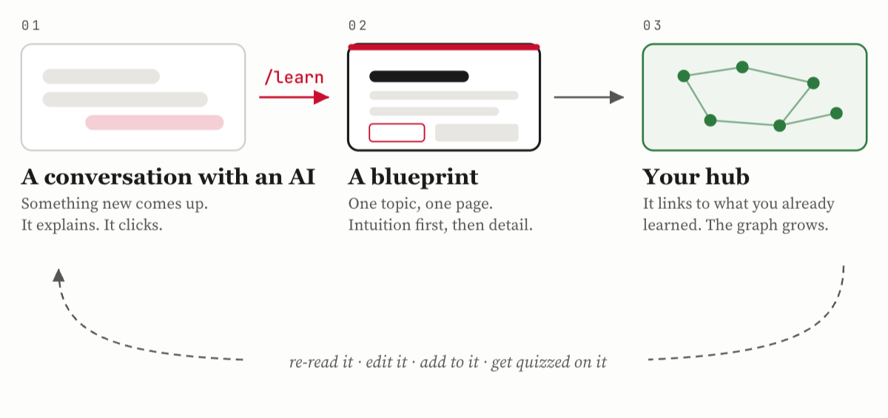

# Learning Hub

Keep the explanations that made something click.

You are working with an AI and something comes up that you do not really
understand. You ask. It explains, it clicks, you move on. Then the chat scrolls
away, and a month later you are asking the same question again.

This is where that explanation goes instead: one **blueprint** per topic,
written for you, that you keep and keep editing.

## The loop

<picture>
  <source media="(prefers-color-scheme: dark)" srcset="docs/loop-dark.png">
  
</picture>

A blueprint keeps changing. You go back to it and fix the part that was wrong,
add the example you only understood later, link it to the topic you picked up
this week.

## What a blueprint looks like

<picture>
  <source media="(prefers-color-scheme: dark)" srcset="docs/blueprint-dark.png">
  
</picture>

Plain English first, then examples, then the precise terms. Diagrams appear
where drawing something explains it better than describing it would.

A blueprint is as long as its topic deserves. A session on DNS might be four
sections; one on causal inference might run to fourteen and read like a short
field guide. What makes it one blueprint is that it covers one thing, end to
end, rather than being trimmed to a convenient size. It is a single
self-contained HTML file either way, so it opens anywhere, offline, years from
now.

## It grows into something

<picture>
  <source media="(prefers-color-scheme: dark)" srcset="docs/index-dark.png">
  
</picture>

<p align="center"><sub>The index after a few months. It is generated from your
blueprints, and it ships with one.</sub></p>

Blueprints link to the ones they build on, and those links do the organizing.
Clusters form where you kept linking, so the shape of what you know grows out of
what you actually wrote. The index reads it all back: every blueprint, its tags,
when you last touched it, and which ones are due for a quiz.

This is the idea behind Karpathy's **LLM wiki**: do the reasoning once, when you
write the page, instead of redoing it in every chat.

## Start

```bash
git clone https://github.com/ArturGR3/ai-learning-hub my-learning-hub
cd my-learning-hub
open index.html
```

`topics/example-blueprint.html` is a real lesson and an example of every
convention.

## Write your first one

Install the `/learn` skill once:

```bash
./scripts/install-skill.sh
```

It creates one symlink, `~/.claude/skills/learn` pointing into this repo, and
tells you so before it does. Then type `/learn` in any Claude Code session, in
any project: it teaches you the topic, turns it into a blueprint, files it here,
and offers to quiz you.

Writing the HTML yourself works the same way. File it with:

```bash
./scripts/file-blueprint.sh topics/<name>.html "topic - one line"
```

It validates the page, rebuilds `index.html`, appends `log.md`, commits, and
pushes if you have a remote.

## Make it yours

Rewrite the top section of `AGENTS.md`: who you are and how you learn. That is
what an agent reads before teaching you anything. Everything below it works for
anyone.

Then delete the example and write your first blueprint.

---

To read your hub on your phone, `deploy/` covers the two ways. MIT licensed; the
blueprints you write are yours.
