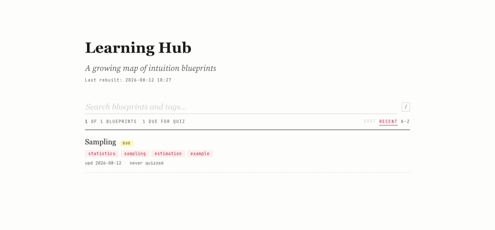
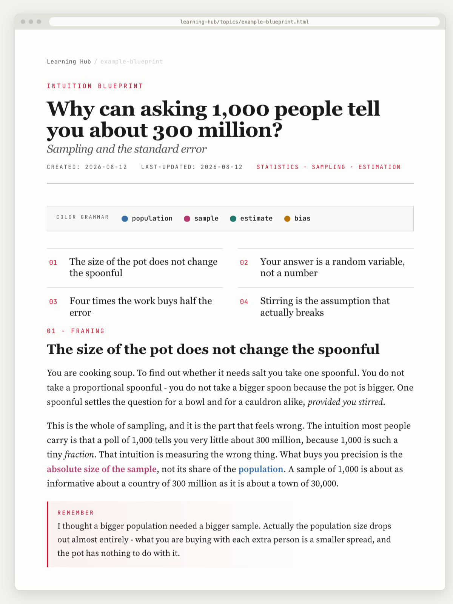

# Learning Hub

A personal wiki of self-contained HTML pages, one per topic you have learned.

<p align="center"></p>

Each page is a **blueprint**: one topic, taught intuition first. Plain English, then
examples, then the precise terms, with a diagram wherever a picture says it faster.

<p align="center"></p>

## The links are the structure

A blueprint links to the ones it builds on, and those link back. That graph is the
only organization - no folders, no categories, nothing to file things under.
Clusters form because you kept linking, and the shape of what you know appears.

```
  probability --> sampling --> regression --> causal inference
                     |                               ^
                     +--------> bootstrap -----------+
```

The idea is borrowed from Karpathy's **LLM wiki**: do the reasoning once, when you
write the page, instead of redoing it in every chat. A chat answers and disappears;
a blueprint stays, and the next one connects to it.

## Start

```bash
git clone https://github.com/ArturGR3/ai-learning-hub my-learning-hub
cd my-learning-hub
open index.html
```

Every asset a page needs ships inside the repo, so the hub opens anywhere, offline.

`topics/example-blueprint.html` is a real lesson and an example of every convention.

## Write one

Install the `/learn` skill once:

```bash
./scripts/install-skill.sh
```

It symlinks `skills/learn/` into `~/.claude/skills/` and changes nothing else. Then
type `/learn` in any Claude Code session: it teaches you the topic, turns it into a
blueprint, files it here, and offers to quiz you afterwards.

Writing the HTML yourself works the same way. File it with:

```bash
./scripts/file-blueprint.sh topics/<name>.html "topic - one line"
```

It validates the page, rebuilds `index.html`, appends `log.md`, commits, and pushes
if you have a remote.

## Make it yours

Rewrite the top section of `AGENTS.md`: who you are and how you learn. That is what
an agent reads before teaching you anything. Everything below it works for anyone.

Then delete the example and write your first blueprint.

---

Reading the hub on your phone is optional and covered in `deploy/`. MIT licensed;
the blueprints you write are yours.
